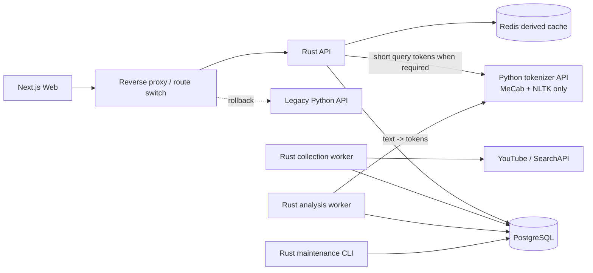

# Monitube 전체 시스템 Rust 전환 개발 지침

> 상태: 제안됨
>
> 범위: API, 수집 worker, 분석 worker, maintenance 도구를 Rust로 전환
>
> 유일한 Python 경계: 기존 MeCab+NLTK tokenizer를 제공하는 내부 전용 API
>
> 작성 기준일: 2026-08-12

## 1. 목적

이 문서는 Monitube의 FastAPI API, 수집 worker, 분석 worker, maintenance 도구를 Rust로 완전히 전환하기 위한 구현·검증·배포 기준을 정의한다. 기존 MeCab+NLTK 구현은 품질과 결과 호환성을 보존하기 위해 stateless 내부 tokenizer API로 격리한다.

이 전환은 단순한 언어 번역이 아니다. 다음 결과를 동시에 달성해야 완료로 인정한다.

1. API, 수집 worker, 분석 worker의 프로세스와 이미지에서 Python, JVM, KoNLPy, MeCab, NLTK 의존성을 제거한다.
2. 기존 웹 애플리케이션이 사용하는 HTTP 계약과 인증 동작을 유지한다.
3. 기존 job·lease·checkpoint·quota·수집·분석 의미를 Rust에서 동일하게 재현한다.
4. 데이터 규모와 무관하게 요청당 메모리가 제한되도록 무제한 조회를 제거한다.
5. tokenizer는 token 추출만 담당하고 BoW, corpus delta, 빈도 집계, ranking은 Rust가 담당한다.
6. 기존 Python 구현 대비 latency, RSS, 장애 복구 능력을 계측 가능한 수준으로 개선한다.
7. API route와 worker 종류별 canary 및 즉시 rollback이 가능한 상태로 점진적으로 전환한다.

문서에서 사용하는 **완전 전환**은 다음 상태를 의미한다.

- 외부 HTTP 요청은 모두 Rust API가 처리한다.
- 수집, job, lease, checkpoint, 분석, BoW/빈도 집계는 모두 Rust가 처리한다.
- API와 Rust worker 컨테이너에는 Python 런타임이 없다.
- Python은 내부 tokenizer 컨테이너에만 존재하고 DB·queue·집계 상태를 소유하지 않는다.
- 구 Python API와 worker는 rollback 기간이 끝난 뒤 제거된다.
- 승인된 변경을 제외하면 API contract differential test 결과가 일치한다.
- API와 모든 장기 실행 worker가 24시간 이상 soak test에서 지속적인 RSS 증가를 보이지 않는다.

## 2. 확정 범위와 비범위

### 2.1 이번 전환 범위

- `/health`, `/ready`
- `/register/key`
- `/v1/auth/*`
- `/v1/sources/*`
- `/v1/collection-requests`
- `/v1/jobs/*`
- `/v1/collection-targets/*`
- `/v1/explore*`
- `/v1/search`
- `/v1/videos/*`
- `/v1/comments/*`
- `/v1/analysis/*`
- 요청 검증, 인증, CORS, 쿠키, 오류 응답
- PostgreSQL 및 Redis 연결
- API 관측성, graceful shutdown, readiness
- YouTube/SearchAPI 수집
- quota, checkpoint, lease, retry, job 상태 전이
- NLP document queue claim과 tokenizer 호출
- 문서별 BoW 생성과 old/new delta 반영
- corpus/daily 빈도 집계와 분석 결과 생성
- analysis run, rollup backfill, maintenance CLI
- 공통 Rust domain, persistence, contracts crate

### 2.2 이번 전환에서 제외하거나 별도 승인할 항목

- PostgreSQL을 다른 데이터베이스로 교체
- 웹 프런트엔드 프레임워크 변경
- 수집 정책·quota 정책의 의미 변경
- 분석 결과의 제품 의미 변경
- 기존 데이터를 파괴하는 스키마 정리
- 1차 전환에서 MeCab+NLTK tokenizer 자체를 Rust로 재작성
- tokenizer 결과의 명사 tag, stop word, normalization 의미 변경

### 2.3 절대 원칙

- Rust 전환을 이유로 API 의미를 암묵적으로 변경하지 않는다.
- 성능 문제를 Rust의 낮은 객체 오버헤드만으로 해결하려 하지 않는다.
- write 요청을 Python과 Rust 구현에 동시에 실행하지 않는다.
- 같은 production queue를 Python worker와 Rust worker가 소유권 구분 없이 동시에 claim하지 않는다.
- rollout 중 destructive migration을 수행하지 않는다.
- 사용자 입력을 SQL 문자열에 직접 삽입하지 않는다.
- ACL 확인 전 cache 결과를 반환하거나 candidate limit을 적용하지 않는다.
- API 요청 경로에서 장문 NLP 분석을 수행하지 않는다.
- tokenizer API에 DB 접속, queue claim, BoW 계산, 집계 책임을 넣지 않는다.

## 3. 현재 결합과 목표 코드 경계

현재 Python worker는 `monitube_api`의 settings, domain, quota, collection policy, PostgreSQL repository, NLP analyzer를 직접 가져온다. 이는 API만 교체할 때는 Python 공용 package 분리가 필요하다는 뜻이지만, 전체 Rust 전환에서는 영구적인 `monitube_core` Python package를 새로 만들 이유가 없다.

기존 Python 코드는 전환 기간의 동작 기준과 rollback 구현으로만 보존한다. 새 공용 domain과 persistence는 처음부터 Rust crate로 작성한다.

### 3.1 목표 저장소 구조

```text
Cargo.toml
Cargo.lock

apps/
  api/
    Cargo.toml
    src/
  collection-worker/
    Cargo.toml
    src/
  analysis-worker/
    Cargo.toml
    src/
  maintenance/
    Cargo.toml
    src/
  tokenizer/
    pyproject.toml
    monitube_tokenizer/
  web/

crates/
  monitube-domain/
  monitube-contracts/
  monitube-application/
  monitube-postgres/
  monitube-collection/
  monitube-analysis/
  monitube-search/
  monitube-observability/
  monitube-test-support/

packages/
  contracts/
    src/
    fixtures/
    openapi/

database/
  migrations/
  tests/
```

### 3.2 공통 Rust crate 소유권

| crate | 책임 |
|---|---|
| `monitube-domain` | source, target, job, lease, checkpoint, quota enum과 불변식 |
| `monitube-contracts` | 공개 HTTP request/response와 내부 tokenizer contract |
| `monitube-application` | API use case와 command orchestration |
| `monitube-postgres` | typed query, transaction, repository 구현 |
| `monitube-collection` | YouTube/SearchAPI client, 수집 phase, retry/checkpoint |
| `monitube-analysis` | BoW, corpus delta, 순수 빈도 ranking, analysis run |
| `monitube-search` | query normalization, indexed candidate, score |
| `monitube-observability` | tracing, metrics, secret redaction |
| `monitube-test-support` | DB fixture, contract comparator, fake upstream |

API와 worker가 같은 crate를 사용하더라도 transaction 소유권과 실행 entrypoint는 분리한다. API 요청이 collection worker 함수를 직접 호출하거나 worker가 API process memory에 의존해서는 안 된다.

### 3.3 Python 코드의 전환 중 역할

- 기존 FastAPI와 worker는 characterization baseline과 rollback 대상으로 유지한다.
- 기능 단위 Rust 구현이 승인되기 전에는 해당 Python 코드를 삭제하지 않는다.
- tokenizer 로직만 `apps/tokenizer`로 추출한다.
- tokenizer 추출 시 기존 golden token과 `mecab-nltk-v1` analyzer version을 유지한다.
- Python repository, job runner, collector, analysis worker는 Rust 전환 완료 후 제거한다.
- 영구적인 Python domain/repository 공용 package를 새로 만들지 않는다.

### 3.4 코드 경계 완료 조건

- API, collection-worker, analysis-worker, maintenance가 하나의 Rust workspace에서 빌드된다.
- tokenizer 외 Rust binary가 Python module을 import하거나 Python process를 embed하지 않는다.
- tokenizer는 DB URL, Redis URL, queue credential을 받지 않는다.
- Rust worker가 기존 Python worker와 독립적으로 integration test를 통과한다.
- 기존 Python 구현은 production rollback window 동안 별도 image digest로 보존된다.

## 4. 목표 런타임 구조



### 4.1 소유권

| 컴포넌트 | 책임 |
|---|---|
| Rust API | HTTP, 인증, ACL, 조회, command 접수, cache, 직렬화 |
| Rust collection-worker | 수집, quota, checkpoint, lease, job 실행 |
| Rust analysis-worker | NLP queue, tokenizer 호출, BoW, corpus delta, 순수 빈도 집계 |
| Python tokenizer API | MeCab+NLTK 기반 token 추출만 수행하는 stateless 내부 서비스 |
| Rust maintenance CLI | rollup backfill, reconciliation, 운영성 일회 작업 |
| PostgreSQL | authoritative state, transaction, idempotency, ACL |
| Redis | 재생성 가능한 bounded derived cache만 저장 |
| Web | 공개 API contract만 의존 |

Rust component끼리는 공통 crate를 사용하지만 실행 상태는 공유하지 않는다. tokenizer는 내부 API contract로만 호출하며 DB나 queue를 소유하지 않는다.

## 5. Rust 프로젝트 구현 기준

### 5.1 권장 계층

```text
apps/api/src/
  main.rs
  http/
    middleware/
    routes/
  state.rs

apps/collection-worker/src/
  main.rs
  runtime.rs

apps/analysis-worker/src/
  main.rs
  runtime.rs
  tokenizer_client.rs

crates/monitube-domain/src/
  job.rs
  source.rs
  quota.rs
  cursor.rs

crates/monitube-application/src/
  auth.rs
  sources.rs
  jobs.rs
  results.rs
  explore.rs
  analysis.rs

crates/monitube-postgres/src/
  api/
  collection/
  analysis/
  maintenance/
```

의존 방향은 `binary -> application/worker crate -> domain + persistence port`로 제한한다. route handler와 worker loop에 SQL을 직접 작성하지 않는다. `monitube-postgres`는 상위 application crate를 의존하지 않는다.

### 5.2 표준 라이브러리 계열

구현 시작 시 호환되는 최신 안정 버전을 검토하고 `Cargo.lock`을 커밋한다. 버전을 부동 범위로 운영하지 않는다.

- async runtime: Tokio 계열
- HTTP/router/middleware: Axum 및 Tower 계열
- PostgreSQL: SQLx 또는 동등한 async driver
- JSON: Serde
- 오류: 명시적인 application error enum
- logging/tracing: structured tracing
- secret wrapper: debug 출력이 차단되는 secret type
- password compatibility: PBKDF2-HMAC-SHA256
- time/UUID: timezone-aware UTC type와 UUID type
- internal tokenizer client: timeout, body limit, connection pool을 지원하는 Rust HTTP client

특정 crate 선택은 교체할 수 있지만 다음 특성은 필수다.

- cancellation-safe connection 사용
- pool wait timeout 지원
- graceful shutdown 지원
- streaming response/body limit 지원
- typed bind parameter 지원
- OpenTelemetry 또는 동등한 tracing 연동 가능

### 5.3 Rust 코딩 규칙

- production code에서 `unwrap()`과 `expect()`를 금지한다. 기동 시 검증된 불변값은 예외로 하되 사유를 주석으로 남긴다.
- `panic!`은 프로세스 불변식 위반에만 사용한다.
- 모든 외부 오류는 내부 원인을 log에 남기고 공개 응답에는 안전한 메시지만 노출한다.
- request handler는 작게 유지하고 application service로 위임한다.
- nullable DB column을 임의의 기본값으로 바꾸지 않는다.
- 숫자 변환 시 overflow를 명시적으로 처리한다.
- 공개 enum에 catch-all을 두지 않는다. 알 수 없는 DB 값은 오류로 처리한다.
- `spawn`한 task는 소유자, 종료 신호, 최대 개수를 가져야 한다.
- 무제한 channel, queue, `Vec`, `HashMap`, cache를 금지한다.
- `Arc` 순환 참조를 금지하고 app state의 종료 순서를 테스트한다.

## 6. HTTP 계약 보존 기준

### 6.1 계약의 기준점

전환 직전 Python FastAPI가 생성한 OpenAPI와 실제 응답 fixture를 기준점으로 커밋한다.

필수 artifact:

```text
packages/contracts/openapi/python-baseline.json
packages/contracts/fixtures/requests/*.json
packages/contracts/fixtures/responses/*.json
packages/contracts/fixtures/errors/*.json
```

OpenAPI만으로 표현되지 않는 다음 동작은 별도 fixture로 고정한다.

- cookie name, path, `HttpOnly`, `SameSite`, `Secure`, max-age
- CORS origin과 credentials
- `Idempotency-Key`
- 204 response body 부재
- validation error의 status와 JSON shape
- 필드 누락과 `null`의 차이
- datetime UTC 직렬화
- query list parameter 반복 방식
- cursor 오류 응답
- Redis 장애 시 PostgreSQL fallback

### 6.2 JSON 규칙

- 기존 response의 camelCase 필드명을 그대로 사용한다.
- request body는 Python의 `extra="forbid"`와 같은 수준으로 미정의 필드를 거부한다.
- 문자열 trim, min/max length, 정규식, 숫자 범위를 동일하게 적용한다.
- default가 있는 필드와 실제 누락 필드를 구분한다.
- 기존에 조건부로 생략되던 필드는 Rust에서도 같은 조건으로 생략한다.
- JSON object key 순서는 계약으로 취급하지 않지만 값과 타입은 정확히 비교한다.
- 부동소수점은 허용 오차가 승인된 분석 필드 외에는 정확히 비교한다.

### 6.3 오류 매핑

최소한 다음 오류 유형을 구분한다.

| application error | HTTP |
|---|---:|
| not found | 404 |
| invalid cursor | 400 |
| unauthenticated | 401 |
| invalid input/config | 422 |
| state conflict/idempotency conflict | 409 |
| pool/database temporarily unavailable | 503 + `retryable: true` |
| unexpected internal error | 500 |

DB constraint 이름이나 SQL text, API key, database URL, stack trace는 공개 응답에 포함하지 않는다.

### 6.4 현재 공개 operation inventory

Rust 전환 추적표에는 다음 40개 operation을 모두 포함한다.

#### System/runtime

- `GET /health`
- `GET /ready`
- `POST /register/key`

#### Auth

- `GET /v1/auth/me`
- `POST /v1/auth/register`
- `POST /v1/auth/login`
- `POST /v1/auth/logout`

#### Resolution

- `POST /v1/channel-resolutions`
- `POST /v1/video-resolutions`

#### Sources/collection/jobs

- `GET /v1/sources`
- `POST /v1/sources`
- `GET /v1/sources/{source_id}`
- `PATCH /v1/sources/{source_id}`
- `DELETE /v1/sources/{source_id}`
- `POST /v1/sources/{source_id}/refresh`
- `GET /v1/sources/{source_id}/jobs`
- `POST /v1/sources/{source_id}/jobs`
- `POST /v1/collection-requests`
- `GET /v1/jobs/active`
- `GET /v1/jobs/recent-failures`
- `GET /v1/jobs/{job_id}`
- `GET /v1/collection-targets/{target_id}/pin`
- `PUT /v1/collection-targets/{target_id}/pin`

#### Results/comments/transcripts

- `GET /v1/sources/{source_id}/results`
- `GET /v1/sources/{source_id}/overview`
- `GET /v1/sources/{source_id}/videos`
- `GET /v1/videos/{youtube_video_id}/transcript`
- `GET /v1/videos/{video_id}/comments`
- `GET /v1/videos/{video_id}/comment-threads`
- `GET /v1/comments/{comment_id}`
- `GET /v1/comments/{comment_id}/replies`

#### Explore/search

- `GET /v1/explore`
- `GET /v1/explore/channels`
- `GET /v1/explore/videos`
- `GET /v1/channels/{youtube_channel_id}/subscriber-history`
- `GET /v1/search`

#### Analysis

- `GET /v1/analysis/excluded-terms`
- `PUT /v1/analysis/excluded-terms/{corpus_kind}`
- `GET /v1/analysis/insights`
- `GET /v1/analysis/overview`

각 operation은 다음 상태 중 하나를 갖는다.

```text
not_started -> implemented -> contract_equal -> shadow_verified
            -> canary -> authoritative -> python_removed
```

## 7. PostgreSQL 구현 규칙

### 7.1 PostgreSQL이 authoritative state다

- API와 worker 사이에 메모리 기반 공유 상태를 만들지 않는다.
- job, lease, checkpoint, quota, idempotency는 기존 PostgreSQL 의미를 유지한다.
- rollout 중 Rust 구현은 기존 Python 구현이 이해하지 못하는 상태값을 먼저 기록하지 않는다.
- schema 변경은 expand -> backfill -> switch read -> contract 순서로 수행한다.

### 7.2 connection pool 예산

다음 식을 deployment gate로 사용한다.

```text
(Rust API replica 수 × API pool max)
+ (collection worker replica 수 × worker pool max)
+ (analysis-worker replica 수 × analysis pool max)
+ migration/admin reserve
<= PostgreSQL max_connections
```

reserve는 운영·migration·장애 진단 연결을 위해 반드시 남긴다. replica 수만 늘리고 pool 크기를 그대로 유지하지 않는다.

필수 timeout:

- connection pool wait timeout
- connect timeout
- statement timeout
- lock timeout
- request deadline
- Redis connect/read timeout

request가 취소되면 DB query와 downstream 작업도 가능한 한 빨리 취소한다.

### 7.3 transaction 규칙

- transaction 경계는 application use case에 둔다.
- 여러 repository 함수가 하나의 원자적 작업이면 같은 transaction handle을 전달한다.
- connection을 얻은 뒤 외부 HTTP 요청이나 장시간 CPU 작업을 실행하지 않는다.
- read-only API는 불필요한 write transaction을 만들지 않는다.
- `FOR UPDATE`, `SKIP LOCKED`, advisory lock의 기존 의미를 임의로 제거하지 않는다.
- idempotency 확인과 생성은 반드시 같은 transaction에서 처리한다.
- unique violation은 constraint 이름으로 분기하고 오류 문자열 검색에 의존하지 않는다.

### 7.4 SQL 규칙

- 모든 사용자 값은 bind parameter로 전달한다.
- 동적 column/order는 compile-time allowlist enum으로만 선택한다.
- 정적 SQL은 typed row mapping을 사용한다.
- nullable column과 JSONB payload를 명시적인 type으로 매핑한다.
- query별 예상 최대 row 수를 코드 또는 SQL 주석에 기록한다.
- `fetch_all`은 SQL에 고정된 상한이 있을 때만 허용한다.
- 대량 backfill과 API 요청 query를 같은 repository 함수로 공유하지 않는다.
- ACL은 결과를 가져온 뒤 애플리케이션에서 필터링하지 않고 SQL 내부에서 적용한다.

### 7.5 상태 전이 및 command API

다음 write path는 read path보다 늦게 전환한다.

- 계정 등록과 session 생성/폐기
- source 생성/수정/삭제
- collection request 제출
- source refresh
- job 생성
- pin 수정
- runtime key 등록
- excluded term 교체

각 path마다 동시 요청, retry, timeout 직후 재요청, duplicate idempotency key, transaction rollback 테스트를 작성한다.

### 7.6 Rust collection-worker 규칙

- 기존 collection phase와 checkpoint key의 의미를 그대로 유지한다.
- job claim은 `FOR UPDATE SKIP LOCKED`와 lease 만료 복구 의미를 보존한다.
- upstream HTTP timeout, retry, quota 분류를 서로 다른 오류 type으로 구분한다.
- retry 가능한 오류만 기존 정책에 따라 resume time을 기록한다.
- quota 대기는 checkpoint를 삭제하지 않는다.
- API key rotation과 quota 우회 금지 정책을 기존 의미대로 유지한다.
- page 저장과 checkpoint 전진은 기존 원자성 보장을 유지한다.
- process 종료 시 신규 claim을 중단하고, 진행 중 job의 lease/현재 stage를 안전하게 남긴다.
- 외부 API response는 size limit을 두고 필요한 필드만 deserialize한다.
- 동시 영상/댓글 수집 개수는 config로 제한하고 무제한 task spawn을 금지한다.

### 7.7 Rust analysis-worker 규칙

- `nlp_documents` queue의 pending, running, delete_pending, failed 의미를 유지한다.
- queue claim과 lease 갱신은 Rust가 담당한다.
- 원문과 segment를 bounded batch로 tokenizer API에 전달한다.
- tokenizer 응답 token으로 Rust가 문서별 sparse BoW를 생성한다.
- 이전 BoW 차감, 새 BoW 저장, scope membership, corpus delta, document 상태 갱신은 하나의 DB transaction에서 수행한다.
- source hash가 claim 이후 바뀌면 결과를 쓰지 않고 pending으로 되돌린다.
- tokenizer timeout과 일시 장애는 bounded exponential backoff와 최대 retry를 적용한다.
- tokenizer 결과 자체를 무기한 process memory에 cache하지 않는다.
- 분석 요청에서 원문이나 모든 문서별 BoW를 다시 순회하지 않는다.

### 7.8 Rust maintenance 도구 규칙

- rollup backfill의 durable cursor와 advisory lock을 유지한다.
- 모든 backfill은 batch size, sleep, lock timeout, max pass를 설정할 수 있어야 한다.
- 재시작 가능하고 같은 batch를 재실행해도 결과가 달라지지 않아야 한다.
- production API pool과 별도 pool budget을 사용한다.
- destructive cleanup은 명시적인 dry-run과 별도 승인을 요구한다.

## 8. 인증 및 보안 호환성

### 8.1 기존 계정 호환

기존 password encoding 형식을 유지한다.

```text
pbkdf2_sha256$310000$<salt-hex>$<digest-hex>
```

- PBKDF2-HMAC-SHA256을 사용한다.
- 검증 비교는 constant-time으로 수행한다.
- 기존 계정은 password reset 없이 로그인 가능해야 한다.
- hash algorithm 변경이 필요하면 로그인 성공 시 점진 rehash하며 별도 migration으로 다룬다.

### 8.2 session 호환

- cookie 이름: `monitube_session`
- token 원문은 DB에 저장하지 않는다.
- DB에는 SHA-256 token hash만 저장한다.
- 기존 session row가 Rust 전환 후에도 유효해야 한다.
- development 외 환경에서는 secure cookie를 유지한다.
- logout은 DB session 폐기와 browser cookie 삭제를 모두 수행한다.
- 만료 갱신은 매 요청마다 불필요한 write가 발생하지 않도록 하나의 조건부 query로 처리한다.

### 8.3 API key와 secret

- 공개 OpenAPI에 `apiKeys`, `apiKey`, `credentialId`, `projectId`, `secretRef`를 노출하지 않는다.
- runtime key 등록 token 비교는 constant-time이어야 한다.
- API key 원문을 log, trace, error, panic payload에 포함하지 않는다.
- config debug 출력에서 database URL password와 secret을 마스킹한다.
- Rust core dump와 panic backtrace 운영 정책을 명시한다.

## 9. 한국어 검색 및 NLP 전략

### 9.1 기본 결정

기존 `mecab-nltk-v1` tokenizer의 한국어·영어 명사 추출 결과를 유지한다. Python은 이 token 추출만 담당하고, 나머지 NLP pipeline은 Rust가 소유한다.

책임을 다음처럼 고정한다.

| 단계 | 구현 | 책임 |
|---|---|---|
| token 추출 | Python tokenizer API | MeCab+NLTK, normalization, noun tag, stop word |
| queue/lease/retry | Rust analysis-worker | document claim, timeout, retry, source hash 검증 |
| BoW | Rust analysis-worker | token list를 문서별 `{term: count}`로 변환 |
| 증분 집계 | Rust + PostgreSQL | 이전 BoW 차감, 새 BoW 가산, 전체/일별 TF·DF 갱신 |
| 빈도 ranking | Rust API/analysis | 저장된 `total_term_frequency` 내림차순 |
| 검색 | Rust API + PostgreSQL | ACL 적용 candidate 검색과 bounded ranking |

**TF-IDF는 사용하지 않는다.** IDF를 계산하거나 TF-IDF score를 저장·조회·표시하지 않는다. 빈도 화면의 순서는 오직 `total_term_frequency` 내림차순이며, 같은 빈도일 때만 결정적인 결과를 위해 term 오름차순을 사용한다. `document_frequency`는 표시용 보조 통계일 뿐 순위에 영향을 주지 않는다.

### 9.2 현재와 목표 BoW 의미

현재 구현은 이미 문서별 sparse BoW를 만든다.

```text
tokens = ["분석", "영상", "분석"]
BoW = {"분석": 2, "영상": 1}
token_count = 3
```

Rust 전환 후에도 다음 저장 의미를 유지한다.

- `nlp_document_terms.term_frequency`: 문서 하나의 BoW count
- `nlp_documents.token_count`: 해당 문서의 유효 token 총수
- `nlp_corpus_stats.document_count`: 범위·corpus의 문서 수
- `nlp_corpus_stats.total_token_count`: 범위·corpus의 token 총수
- `nlp_term_stats.document_frequency`: term을 한 번 이상 포함한 문서 수
- `nlp_term_stats.total_term_frequency`: 범위 전체에서 term이 등장한 총 횟수
- `nlp_daily_*`: 기간 필터를 위한 일별 동일 집계
- `video_transcript_segments.search_terms`: 대본 snippet 검색용 segment token 집합

문서가 수정되면 매번 전체 corpus를 다시 계산하지 않는다.

```text
1. 기존 document BoW와 scope membership 조회
2. 기존 BoW가 corpus/daily aggregate에 기여한 delta 차감
3. 새 token으로 Rust에서 새 BoW 생성
4. 새 document BoW 저장
5. 새 scope membership 기준으로 aggregate delta 가산
6. document를 ready로 변경
```

위 과정은 하나의 PostgreSQL transaction에서 처리한다. 조회 API는 원문을 다시 tokenize하거나 전체 `nlp_document_terms`를 다시 세지 않고 `nlp_term_stats` 또는 기간별 `nlp_daily_term_stats`만 읽는다.

### 9.3 tokenizer 내부 API

tokenizer는 별도 Python 컨테이너로 배포한다. 공개 ingress에 노출하지 않는다.

권장 endpoint:

```text
POST /internal/v1/tokenize
GET  /health
GET  /ready
```

request 예시:

```json
{
  "analyzerVersion": "mecab-nltk-v1",
  "documents": [
    {
      "id": "document-id",
      "text": "영상 분석 OpenAI market",
      "segments": [
        {"sequence": 0, "text": "영상 분석"}
      ]
    }
  ]
}
```

response 예시:

```json
{
  "analyzerVersion": "mecab-nltk-v1",
  "documents": [
    {
      "id": "document-id",
      "tokens": ["영상", "분석", "openai", "market"],
      "segments": [
        {"sequence": 0, "tokens": ["영상", "분석"]}
      ]
    }
  ]
}
```

tokenizer API는 다음을 하지 않는다.

- `Counter`, BoW, 빈도, DF, corpus 통계 계산
- DB/Redis 접속
- queue claim, lease, retry
- source hash 검증
- 사용자·target·owner ACL 처리
- 분석 결과 저장

tokenizer가 반환하는 것은 순서가 보존된 token 목록과 analyzer version뿐이다. Rust analysis-worker가 token 목록을 `HashMap<String, u32>` 형태의 sparse BoW로 계산한다.

### 9.4 tokenizer API 운영 규칙

- 한 요청의 document 수, 원문 byte, segment 수, 총 token 수를 제한한다.
- 긴 대본은 bounded chunk로 나누고 Rust가 최종 BoW를 합산한다.
- request ID와 document ID로 응답을 대응하되 원문을 log하지 않는다.
- timeout, concurrency, CPU, memory limit을 명시한다.
- 같은 analyzer version과 입력은 항상 같은 token sequence를 반환해야 한다.
- service 기동 시 현재 analyzer health fixture를 실행한다.
- Rust client는 response analyzer version이 요청과 다르면 결과를 폐기한다.
- 내부 service credential 또는 mTLS와 network policy로 접근을 제한한다.
- tokenizer 장애 시 document lease를 해제하고 bounded retry한다.
- tokenizer 서비스가 unavailable일 때 다른 tokenizer로 조용히 fallback하지 않는다.

### 9.5 검색 query 처리

- ID/handle은 Rust에서 exact/prefix search한다.
- 제목·설명·댓글은 PostgreSQL trigram/indexed document를 사용한다.
- 대본 term 검색에 동일 token 의미가 필요하면 Rust API가 짧은 query만 tokenizer API에 보낸다.
- 짧은 query token은 bounded TTL cache가 가능하지만 cache key와 entry 수를 제한한다.
- tokenizer 호출은 전체 검색 request deadline 안에서 짧은 timeout을 갖는다.
- tokenizer가 필요한 검색에서 service가 실패하면 명시적인 503 또는 승인된 degraded response를 사용한다. 결과 의미가 달라지는 silent fallback은 금지한다.
- ACL을 적용하기 전에 global `LIMIT`을 걸어 authorized result가 누락되지 않도록 한다.
- 전체 row가 아니라 ID와 score만 먼저 bounded candidate barrier를 통과시킨다.

### 9.6 순수 빈도 조회 규칙

전체 기간은 `nlp_term_stats`에서 bounded top-N을 읽는다.

```sql
ORDER BY total_term_frequency DESC,
         term ASC
LIMIT $1
```

기간 필터는 원문이나 문서별 BoW를 읽지 않고 `nlp_daily_term_stats`를 기간 범위에서 합산한 뒤 같은 순서로 bounded top-N을 구한다. `document_frequency`는 응답에 포함할 수 있지만 정렬에는 사용하지 않는다.

응답 필드 의미:

- `termCount`: `total_term_frequency`
- `documentCount`: `document_frequency`
- `documentRate`: `document_frequency / corpus_document_count * 100`

빈도 ranking에 TF-IDF, logarithmic TF, IDF, embedding similarity를 섞지 않는다. 다른 ranking이 필요하면 별도 지표와 별도 API contract로 설계한다.

### 9.7 analyzer 변경과 재색인

token 결과가 바뀌면 기존 analyzer version을 재사용하지 않는다.

1. 새 analyzer version을 추가한다.
2. golden token corpus 차이를 승인한다.
3. 새 version BoW와 aggregate를 별도로 backfill한다.
4. 문서 수, 총 token, 상위 빈도 결과를 비교한다.
5. 모든 scope의 backfill 완료 후 read version을 전환한다.
6. rollback 기간 후 이전 version을 정리한다.

재색인 중에도 frequency 조회가 서로 다른 analyzer version의 aggregate를 섞지 않도록 한다.

## 10. 메모리 안정성 규칙

### 10.1 무제한 조회 금지

다음 패턴을 production API에서 금지한다.

- `SELECT ...` 뒤에 상한 없이 전체 결과를 `Vec`으로 수집
- 영상 전체를 조회한 뒤 API에서 정렬/필터링
- 대본 `full_text`와 모든 segment를 한 응답에서 중복 materialization
- 전체 댓글을 가져와 top words 계산
- 사용자별 모든 channel/source를 영구적으로 무제한 반환
- cache key 또는 metric label에 user/query 원문을 무제한 추가

예외가 필요한 작은 reference table은 최대 cardinality 근거와 테스트를 PR에 기록한다.

### 10.2 반드시 개선할 기존 endpoint

#### `/v1/sources/{source_id}/results`

이 legacy endpoint는 전체 영상 배열을 반환한다. 완전 전환 전 웹이 `/overview`와 keyset `/videos`만 사용하도록 고정한다.

호환 기간 중 선택지는 다음 순서로 적용한다.

1. 신규 웹은 bounded endpoint만 사용한다.
2. legacy endpoint 호출량을 측정한다.
3. 외부 consumer가 없음을 확인한다.
4. deprecation 기간을 공지한다.
5. Rust 구현에서는 임시 streaming encoder를 사용하거나 legacy Python route로 유지한다.
6. 승인된 contract version에서 endpoint를 제거한다.

호출자가 남아 있는 동안 의미를 조용히 바꾸거나 배열을 잘라 반환하지 않는다.

#### `/v1/videos/{youtube_video_id}/transcript`

- segment pagination 또는 별도 segment endpoint를 추가한다.
- summary metadata와 full text/segments 조회를 분리한다.
- 최대 response byte를 적용한다.
- 기존 endpoint는 사용량 확인 후 versioned deprecation한다.

#### `/v1/analysis/insights`

- 사용자 visible video 전체를 API 메모리로 가져오지 않는다.
- 집계, percentile, top-K 후보 축소를 SQL 또는 사전 집계 결과로 이동한다.
- API에는 최종 bounded row만 전달한다.

#### source/channel 목록

- cardinality 증가가 가능한 목록은 cursor pagination을 추가한다.
- `total` 계산이 고비용이면 정확한 total 필요성을 제품 계약에서 재검토한다.

### 10.3 요청/응답 제한

각 route에 다음 값을 정의한다.

- 최대 request body byte
- 최대 query string 길이
- 최대 list parameter 개수
- 최대 DB rows
- 최대 response byte
- request deadline
- 최대 동시 실행 수

제한 초과는 process OOM이 아니라 명시적인 4xx 또는 bounded 5xx로 종료한다.

worker와 tokenizer에도 다음 상한을 둔다.

- job당 최대 동시 upstream 요청
- batch당 DB row와 payload byte
- tokenizer 요청당 document/segment/text byte
- tokenizer 응답당 token 수와 byte
- analysis-worker가 동시에 보유할 BoW 수와 총 term 수
- queue prefetch 수
- retry queue와 in-memory channel 크기

### 10.4 cache 제한

- process-local cache는 entry 수와 총 byte를 모두 제한한다.
- Redis만 사용 가능한 결과는 만들지 않는다.
- cache value는 재생성 가능해야 한다.
- owner ACL 또는 session 자체를 derived cache에 위임하지 않는다.
- key cardinality와 TTL을 metric으로 관찰한다.
- cache stampede lock에도 timeout과 최대 wait를 둔다.

### 10.5 메모리 합격 기준

실제 production representative workload로 검증한다.

- warm-up 이후 24시간 RSS 추세가 단조 증가하지 않는다.
- 24시간 선형 RSS 증가율이 5 MiB/hour 미만이며 종료 시점에도 안정 구간으로 회귀한다.
- peak RSS가 컨테이너 limit의 70%를 넘지 않는다.
- 단일 최대 허용 요청이 process RSS를 limit까지 밀어 올리지 않는다.
- client disconnect 반복 후 active task, connection, buffer 수가 baseline으로 돌아온다.
- Redis/PostgreSQL timeout 반복 후 resource count가 회복된다.
- tokenizer 대용량 요청과 timeout 반복 후 Python tokenizer RSS가 안정 구간으로 돌아온다.
- collection/analysis worker가 job을 반복 처리한 뒤 task, connection, BoW buffer 수가 baseline으로 돌아온다.

custom allocator는 benchmark와 profile로 필요성이 증명된 경우에만 도입한다.

## 11. 성능 기준

### 11.1 전환 전 baseline

같은 데이터 snapshot과 같은 workload window에서 다음을 기록한다.

- route별 RPS, p50, p95, p99
- response byte
- DB pool wait와 timeout
- query count와 query latency
- returned/scanned rows
- PostgreSQL temp blocks/files
- PostgreSQL CPU, I/O, lock wait
- API RSS, CPU, thread/task 수
- collection-worker job throughput, RSS, CPU, active task, lease loss
- analysis-worker document throughput, RSS, CPU, queue age, retry
- tokenizer latency, RSS, CPU, input byte, output token 수
- BoW term 수, corpus delta 처리 시간, aggregate write row 수
- Redis hit/miss/error
- 4xx/5xx 비율

`pg_stat_statements` 누적값은 측정 window를 명시하거나 reset 후 사용한다.

### 11.2 route 합격 기준

각 route는 Python과 Rust를 동일 조건에서 비교한다.

- contract mismatch: 0건
- 예상 workload의 오류율: Python보다 악화 금지
- p95: Python baseline 이하
- p99: Python baseline 대비 10% 이상 악화 금지
- response byte: 승인된 contract 변경 외 증가 금지
- DB query count: 증가 시 명시적 승인 필요
- scanned/returned row: 증가 금지
- pool timeout: 증가 금지
- Rust route의 peak RSS contribution: 측정 가능한 bounded 상태

DB가 지배적인 endpoint는 Rust 자체 latency 개선률보다 query rows, DB time, RSS 제한을 우선 합격 기준으로 사용한다.

## 12. 관측성

### 12.1 모든 요청에 필요한 정보

- request ID
- route template
- HTTP method/status
- duration
- response byte
- authenticated 여부. 사용자 식별자 원문은 metric label에 넣지 않는다.
- DB pool wait
- DB query time/count
- Redis time/result
- timeout/cancel 여부

### 12.2 process metric

- RSS 및 virtual memory
- CPU
- active requests
- queued requests
- Tokio task 수 또는 동등 지표
- open DB/Redis connections
- pool available/waiting/timeouts
- panic count
- graceful shutdown duration

### 12.3 logging 규칙

- JSON structured log를 사용한다.
- password, session token, API key, authorization header를 절대 기록하지 않는다.
- SQL bind parameter는 기본적으로 기록하지 않는다.
- client 오류와 server 오류를 다른 level로 기록한다.
- 503은 pool wait, statement timeout, connection failure를 내부 reason으로 구분한다.
- panic hook은 request ID와 안전한 context만 남긴다.

## 13. 테스트 전략

### 13.1 Unit test

- source/channel/video input resolution
- cursor encode/decode 및 tamper/invalid input
- collection policy의 Rust API 관련 부분
- response presenter
- validation boundary
- error mapping
- 한국어 query normalization corpus
- password/session hash compatibility
- job state transition과 checkpoint resume
- quota/retry error classification
- token list에서 sparse BoW 생성
- old/new BoW delta 계산
- `total_term_frequency` 순수 빈도 정렬과 동률 규칙
- tokenizer client timeout/version mismatch/body limit

### 13.2 Contract test

Python API와 Rust API에 동일 요청을 보내 다음을 비교한다.

- status
- response headers 중 계약 대상
- cookie attributes
- canonicalized JSON
- 오류 JSON
- field omission/null
- timestamp

비결정적 값은 fixture에서 통제하거나 명시적인 comparator를 사용한다. 전체 필드를 무시하는 broad snapshot mask를 금지한다.

### 13.3 PostgreSQL integration test

실제 PostgreSQL 16 계열 컨테이너에 모든 migration을 적용해 실행한다.

- empty DB
- legacy data가 있는 DB
- multi-user ACL
- shared target/subscription
- duplicate idempotency
- concurrent source/job command
- lock timeout
- pool exhaustion
- Redis unavailable
- stale/current analysis version
- rollup enabled/disabled 조합
- Python tokenizer API와 Rust client contract
- BoW insert/update/delete와 scope membership 변경
- 전체/일별 TF·DF aggregate invariant
- source hash 변경 중 stale tokenizer 결과 폐기

mock DB 테스트만으로 production readiness를 승인하지 않는다.

### 13.4 Differential test

read route는 production scrubbed snapshot 또는 동등 규모 fixture에서 Python/Rust 결과를 비교한다.

- row 순서
- cursor 다음 페이지
- snapshot consistency
- ACL
- aggregate count
- search ranking과 matched fields
- analysis rounding
- stale/building/failed status
- collection 완료 후 job/checkpoint/provider ledger
- 문서별 BoW와 전체/일별 corpus aggregate
- 순수 빈도 상위 term과 document rate

write route는 같은 DB에 이중 실행하지 않는다. 독립 DB 두 개에 같은 초기 snapshot을 만든 뒤 각각 실행하고 최종 DB state와 response를 비교한다.

### 13.5 Load/soak test

최소 시나리오:

- source workspace polling
- active job polling
- explore pagination
- comment thread pagination
- Korean/English search 혼합
- analysis core/content 병렬 요청
- login/session refresh
- client disconnect storm
- PostgreSQL 느린 query와 pool exhaustion
- Redis down/restart
- graceful deployment restart
- collection-worker lease loss/process kill/restart
- tokenizer timeout/down/restart와 NLP queue recovery
- 대용량 대본 chunk tokenize와 Rust BoW merge
- analysis-worker 지속 BoW/delta 처리

테스트 데이터는 작은 fixture가 아니라 예상 production cardinality 이상이어야 한다.

### 13.6 현재 Python baseline

작성 시점 기준 Python API test suite는 전체 통과한다. 이 상태를 최초 characterization baseline으로 사용하며, Rust 전환 중 기존 테스트 실패를 “Rust에서는 불필요”하다는 이유로 삭제하지 않는다.

## 14. 단계별 전환 계획

### Phase 0 — 측정과 계약 동결

작업:

- Python OpenAPI baseline 커밋
- 대표 success/error fixture 생성
- route별 production baseline 기록
- 현재 feature flag 상태 기록
- DB schema/migration version 기록
- API consumer inventory 작성

완료 조건:

- latency와 RSS 문제를 재현할 workload가 있다.
- 40개 operation의 owner와 consumer가 식별됐다.
- rollback 가능한 Python image digest가 고정됐다.

### Phase 1 — 언어 전환 전 bounded API 정리

작업:

- source overview/keyset pagination 사용 강제
- legacy results fallback 호출량 제거
- transcript pagination 설계
- analysis insights 전체 hydrate 제거
- source/channel 목록 pagination 추가
- performance flag reconciliation 완료
- API memory/concurrency limit 설정

완료 조건:

- 데이터 증가에 따라 단일 응답 메모리가 선형 증가하는 핵심 route가 없다.
- Python API에서도 동일한 load test가 안정적으로 완료된다.

### Phase 2 — Rust workspace와 tokenizer API 분리

작업:

- Rust workspace와 lockfile 생성
- 공통 domain/contracts/postgres/observability crate 생성
- 기존 MeCab+NLTK analyzer를 stateless tokenizer API로 추출
- tokenizer internal contract와 golden token fixture 고정
- tokenizer에 request/body/concurrency/memory limit 적용
- tokenizer에서 DB/queue dependency 제거
- config validation
- PostgreSQL/Redis pool
- structured tracing/metrics
- error model
- graceful shutdown

완료 조건:

- tokenizer 결과가 기존 `mecab-nltk-v1` fixture와 일치한다.
- tokenizer는 token 목록만 반환하고 BoW나 DB 상태를 소유하지 않는다.
- Rust workspace의 공통 crate가 API와 worker binary에서 사용 가능하다.
- 기존 Python API/worker는 이 단계에서 그대로 rollback 가능하다.

### Phase 3 — Rust API foundation

작업:

- `/health`, `/ready`
- container image와 Compose service 추가

완료 조건:

- DB/Redis 장애와 복구가 readiness에 정확히 반영된다.
- SIGTERM 시 신규 요청을 중단하고 진행 중 요청을 제한 시간 내 정리한다.
- Rust 이미지에 Python/JVM/NLP runtime이 없다.

### Phase 4 — 순수·단순 read route

권장 순서:

1. channel/video resolution
2. source 단건/list
3. job 단건/list
4. subscriber history
5. paginated source videos
6. comment replies/thread

완료 조건:

- operation별 contract equality
- shadow traffic equality
- ACL test 통과
- route별 성능 gate 통과

### Phase 5 — 복잡 read/search/analysis

작업:

- source overview
- explore
- search
- transcript
- analysis overview/insights
- derived Redis cache

이 단계에서 전체 hydrate, repeated CTE, in-process ranking을 제거한다. Python 구현의 비효율을 그대로 복사하지 않는다.

완료 조건:

- 대규모 데이터 differential test 통과
- search relevance 승인 corpus 통과
- 24시간 read-only soak test 통과

### Phase 6 — Auth 및 write route

권장 순서:

1. session 조회/로그아웃
2. login/register
3. excluded terms
4. pin
5. source update/delete
6. source/create collection request
7. refresh/job create
8. runtime key registration

완료 조건:

- 기존 계정과 session 호환
- concurrency/idempotency test 통과
- 기존 Python worker가 Rust API가 생성한 job을 정상 처리
- write route별 rollback 절차 검증

### Phase 7 — Rust collection-worker 전환

작업:

- YouTube/SearchAPI client와 safe error mapping
- runtime key load/rotation 정책
- job claim/lease/heartbeat
- collection phase와 checkpoint
- channel/keyword/video discovery
- video/comment/transcript 수집
- quota/wait/retry 상태 전이
- pin dispatch와 parent/child job fan-out

완료 조건:

- 독립 DB snapshot에서 Python/Rust worker의 최종 DB state가 일치한다.
- 동일 upstream fixture에서 checkpoint와 provider request ledger가 일치한다.
- lease loss와 process kill 후 안전하게 재개한다.
- Python과 Rust worker를 동일 production queue의 무구분 claimant로 실행하지 않는다.
- 전환 시 Python worker의 신규 claim을 중단하고 진행 lease를 drain 또는 expire한 뒤 Rust owner를 활성화한다.

### Phase 8 — Rust analysis-worker와 maintenance 전환

작업:

- NLP queue claim/lease/retry
- tokenizer API client
- token 목록에서 sparse BoW 생성
- old/new BoW delta transaction
- 전체/일별 corpus TF·DF 집계
- 순수 `total_term_frequency` ranking
- analysis run 생성/claim/완료
- rollup backfill/reconciliation CLI

완료 조건:

- 기존 문서별 BoW와 Rust BoW가 동일하다.
- 전체/일별 document count, token count, DF, total TF가 기존 값과 일치한다.
- 빈도 상위 결과의 term, termCount, documentCount, documentRate가 일치한다.
- 분석 조회에서 원문 재tokenize와 corpus 전체 재집계가 발생하지 않는다.
- tokenizer 장애 후 lease와 queue depth가 정상 회복된다.

### Phase 9 — Canary와 authoritative 전환

read route는 다음 비율을 기본으로 한다.

```text
shadow -> 1% -> 5% -> 25% -> 50% -> 100%
```

각 단계에서 최소 하나의 peak workload window를 관찰한다. 단계 상승은 자동 시간이 아니라 metric gate로 결정한다.

write route는 사용자 비율 분할보다 route 단위 ownership 전환을 우선한다. 같은 command를 양쪽에 보내지 않는다.

worker는 HTTP read route처럼 단순 비율 shadowing하지 않는다. 다음 중 하나로만 canary한다.

- production snapshot을 복제한 격리 DB에서 Python/Rust 결과 비교
- 명시적인 engine assignment가 있는 별도 queue partition
- 특정 target/job을 하나의 engine에만 배정하는 durable routing column

engine assignment 없이 같은 job을 두 구현이 처리하는 dual execution을 금지한다.

### Phase 10 — Legacy Python 제거

제거 조건:

- 모든 operation이 Rust authoritative 상태다.
- rollback 관찰 기간이 끝났다.
- Python API에 유효 트래픽이 없다.
- Python collection/analysis worker가 신규 job을 claim하지 않는다.
- Rust API와 모든 Rust worker가 24시간 soak와 peak traffic을 통과했다.
- tokenizer 외 production Python process가 없다.
- 운영 runbook과 on-call 문서가 Rust 기준으로 갱신됐다.

제거 작업:

- legacy Python API service 제거
- Python API Dockerfile 제거
- legacy Python collection/analysis worker service 제거
- legacy Python backfill/maintenance command 제거
- 사용하지 않는 FastAPI/Pydantic API dependency 제거
- API와 worker용 MeCab/NLTK/JVM image layer 제거
- MeCab/NLTK/JVM은 tokenizer image에만 유지
- 계약 fixture와 rollback image 기록 보존
- destructive DB cleanup은 별도 후속 migration으로 연기

## 15. 배포와 rollback

### 15.1 배포 원칙

- Python API와 Rust API는 동시에 기동 가능해야 한다.
- Python worker와 Rust worker는 rollback을 위해 동시에 배포할 수 있지만 같은 job의 실행 소유권은 하나만 가져야 한다.
- reverse proxy 또는 내부 route switch로 소유권을 변경한다.
- schema는 두 버전이 동시에 읽을 수 있어야 한다.
- migration과 code switch를 같은 비가역 단계로 묶지 않는다.
- Rust API 장애가 Rust worker의 job 처리까지 중단시키지 않도록 worker의 API readiness dependency를 제거하거나 완화한다.
- tokenizer 장애는 collection-worker를 중단시키지 않고 NLP queue에만 backpressure를 발생시켜야 한다.

### 15.2 즉시 rollback 조건

다음 중 하나면 해당 route, worker engine 또는 전체 component를 기존 Python 구현으로 되돌린다.

- contract mismatch
- ACL 데이터 노출 가능성
- 기존 session 대량 무효화
- idempotency 중복 생성
- job state/lease 불일치
- p99 기준 초과가 지속됨
- DB pool timeout 또는 DB CPU 급증
- RSS가 안정 구간 없이 지속 증가
- Redis 장애가 API 장애로 전파
- 5xx 비율이 baseline 허용치를 초과

### 15.3 rollback이 DB rollback을 요구하지 않게 한다

- additive schema만 먼저 배포한다.
- Rust 전용 column에도 Python이 무시 가능한 default/null 정책을 둔다.
- read switch는 feature flag 또는 router 설정으로 되돌린다.
- dual-write data는 rollback 후에도 남겨두고 즉시 삭제하지 않는다.
- cleanup migration은 Rust 안정화가 끝난 별도 릴리스에서 수행한다.

## 16. CI/CD gate

모든 Rust API/worker/shared crate PR은 최소 다음을 통과해야 한다.

```text
format
lint (warnings denied)
unit tests
Python/Rust contract tests
PostgreSQL integration tests
upstream client fixture tests
tokenizer contract and golden token tests
BoW and corpus-delta invariant tests
database migration verification
dependency/license audit
container build
container vulnerability scan
secret scan
representative smoke test
```

release candidate에는 추가로 다음을 실행한다.

```text
differential test
load test
soak test
graceful shutdown test
PostgreSQL/Redis fault injection
rollback rehearsal
```

## 17. PR 작성 및 리뷰 기준

route 또는 worker 기능 전환 PR은 다음 내용을 포함한다.

- 대상 operation
- 대상 worker phase 또는 queue 종류
- Python source 위치
- SQL/transaction 의미
- request/response/error fixture
- ACL 근거
- 최대 rows/response byte
- Python/Rust benchmark
- contract diff 결과
- feature flag 또는 route switch
- rollback 방법
- 관측 dashboard 링크

리뷰 체크리스트:

- [ ] 사용자 입력이 모두 bind parameter인가?
- [ ] ACL이 candidate limit보다 먼저 적용되는가?
- [ ] query 결과에 명시적인 상한이 있는가?
- [ ] transaction 경계가 Python과 동일한가?
- [ ] idempotency와 retry가 안전한가?
- [ ] null/default/누락 필드가 호환되는가?
- [ ] secret이 log/error에 노출되지 않는가?
- [ ] timeout과 cancellation이 있는가?
- [ ] task/channel/cache가 bounded인가?
- [ ] Redis 없이 정상 동작하는가?
- [ ] worker와 동일 DB에서 통합 테스트했는가?
- [ ] tokenizer는 token 추출 외 상태를 소유하지 않는가?
- [ ] BoW와 corpus delta가 Rust에서 계산되는가?
- [ ] 빈도 순위에 TF-IDF 또는 IDF가 섞이지 않는가?
- [ ] worker engine ownership이 단일한가?
- [ ] rollback이 DB 복구를 요구하지 않는가?

## 18. 완료 정의

다음 항목이 모두 충족되어야 “Monitube 전체 Rust 전환 완료”로 선언한다.

- [ ] 40개 operation 전환 또는 승인된 versioned deprecation 완료
- [ ] Python/Rust contract mismatch 0건
- [ ] 기존 계정과 session 호환
- [ ] Rust collection-worker 전체 기능 정상
- [ ] Rust analysis-worker와 maintenance 도구 전체 기능 정상
- [ ] source/job/idempotency 상태 일치
- [ ] job/lease/checkpoint/quota 상태 전이 일치
- [ ] 기존 tokenizer golden corpus 일치
- [ ] 문서별 BoW와 전체/일별 TF·DF delta 일치
- [ ] 순수 `total_term_frequency` 빈도 순위 일치
- [ ] TF-IDF/IDF 계산 경로 없음
- [ ] 모든 대량 목록 bounded 또는 streaming
- [ ] API와 Rust worker의 Python/NLP runtime 제거
- [ ] API와 Rust worker 이미지에 Python/JVM/KoNLPy/MeCab/NLTK 없음
- [ ] tokenizer만 Python/JVM/KoNLPy/MeCab/NLTK를 포함
- [ ] tokenizer에 DB/Redis/queue 접근 권한 없음
- [ ] route p95가 Python baseline 이하
- [ ] p99, DB CPU, pool timeout 악화 없음
- [ ] API와 모든 worker의 24시간 soak test 메모리 기준 통과
- [ ] 장애 주입과 graceful shutdown 통과
- [ ] canary 100%에서 peak traffic 관찰 완료
- [ ] rollback rehearsal 완료
- [ ] 운영·배포·보안 runbook 갱신
- [ ] Python API 트래픽 0 확인
- [ ] legacy Python API/worker/maintenance 제거

## 19. 구현자가 임의로 변경하면 안 되는 결정

다음 변경은 Rust 전환 PR에 섞지 않고 별도의 설계 승인을 받는다.

- API version 변경
- job state 추가/삭제
- collection/quota 정책 변경
- 사용자별 데이터 소유권 모델 변경
- password/session format 변경
- PostgreSQL 외 저장소 도입
- Redis를 source of truth로 변경
- search ranking 제품 의미 변경
- 분석 지표 정의 변경
- 순수 빈도 ranking에 TF-IDF/IDF/embedding score를 혼합
- tokenizer API에 DB·queue·BoW·빈도 집계 책임 추가
- tokenizer 결과 의미 또는 analyzer version을 승인 없이 변경
- destructive schema cleanup

Rust 전환의 성공 기준은 코드가 Rust로 컴파일되는 것이 아니다. 동일한 제품 의미를 유지하면서 데이터 규모가 증가해도 latency와 메모리가 예측 가능한 시스템으로 바뀌는 것이 최종 기준이다.
