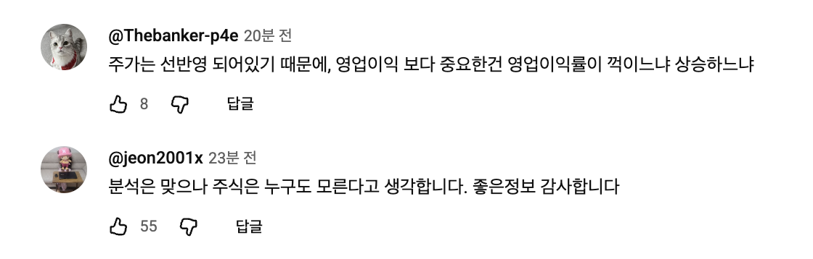
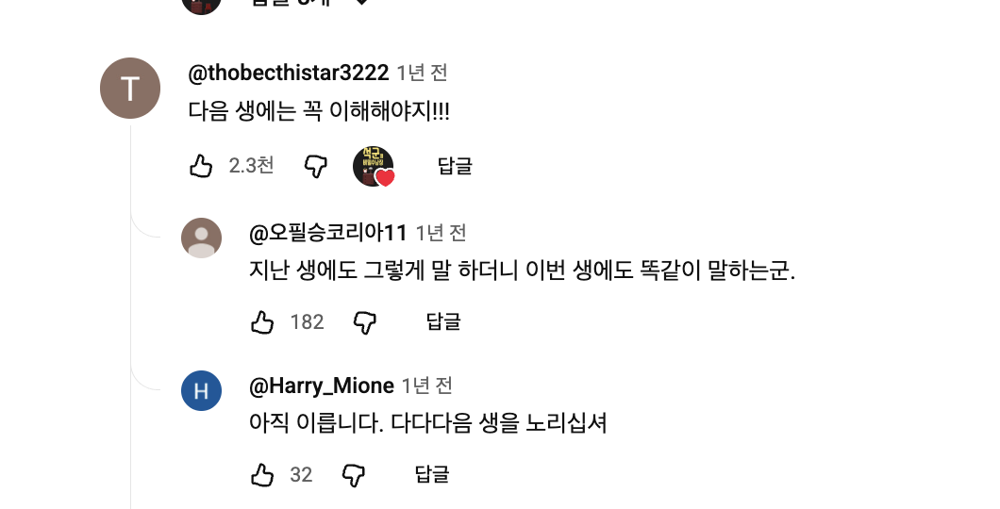

# YouTube 스타일 댓글 표시 설계 및 구현 계획

## 문서 상태

- 상태: 1차 구현·프로덕션 배포 완료 (2026-07-18)
- 범위: Monitube에서 현재 댓글을 표시하는 화면의 공통 UI, 댓글 스레드 조회 계약, 영상·댓글 상세 팝업 동작
- 1차 목표: 현재 저장된 댓글을 정확한 스레드 단위로, 페이지네이션 가능한 읽기 전용 UI로 표시
- 2차 목표: 작성자 프로필 이미지와 실제 핸들 등 추가 메타데이터 보강

이 문서는 코드·API·DB·수집기 검토 결과를 반영한다. 시각 컴포넌트보다 댓글 관계와 페이지네이션 계약을 먼저 확정하며, 현재 존재하지 않는 Channels/Sources 전용 댓글 목록은 1차 범위에 포함하지 않는다.

## 구현 결과

1차 범위는 커밋 `4aa6871`로 구현되어 `https://monitube.fin-ally.net/`에 배포됐다.

- 서버: 원댓글 스레드와 답글에 각각 안정적인 keyset cursor를 적용하고, 답글 미리보기·`storedReplyCount`·부모 댓글 맥락을 제공한다.
- DB: `012_comment_thread_pagination.sql`로 원댓글 최신순 조회용 부분 인덱스를 추가했다.
- 웹: `CommentRow`와 `CommentThread`를 공통 컴포넌트로 사용하며, 검색 결과·영상 댓글·댓글 상세·같은 작성자의 댓글에 같은 정보 구조를 적용한다.
- 팝업: 영상 사이드 드로어를 중앙 단일 모달로 교체하고 썸네일·설명·지표·댓글을 함께 표시한다. 댓글 상세는 같은 모달 안에서 전환된다.
- 로딩: 영상 댓글 cursor pagination, 하단 sentinel, 스피너, 수동 `댓글 더 보기`, 답글 펼치기·접기와 오류 상태를 구현했다.
- 검증: API 전체 테스트, 웹 TypeScript 검사와 프로덕션 빌드를 통과했다. 프로덕션에서 검색 범위, 중앙 모달, 댓글 상세 왕복, 실제 대댓글 펼침을 확인했다.

작성자 프로필 이미지·실제 핸들 저장과 과거 데이터 백필은 문서에 적은 2차 범위로 남긴다.

## 목적

Explore의 영상 상세 팝업, 댓글 상세, 같은 작성자의 다른 댓글, 통합 검색 결과에서 댓글을 같은 정보 구조로 표시한다. 사용자는 작성자, 작성 시점, 본문, 반응, 답글 관계를 빠르게 훑을 수 있어야 한다.

참조 경험은 YouTube 댓글의 다음 흐름이다.



1. 작성자 아바타, 표시명 또는 실제 핸들, 상대 시간
2. 읽기 편한 본문
3. 좋아요 수와 답글 펼치기 같은 최소 동작
4. 원댓글 아래에 시각적으로 연결된 답글

대댓글은 다음 구조를 따른다.



## 이번 계획에서 확정하는 원칙

1. 댓글은 개별 행이 아닌 **원댓글 스레드 단위**로 조회하고 페이지네이션한다.
2. 1차 UI는 읽기 전용이다. 좋아요 수는 통계로 표시하고, 싫어요와 답글 작성 UI는 제공하지 않는다.
3. `authorName`은 YouTube 표시명이며 실제 핸들이 아니다. 실제 `authorHandle`이 없으면 `@`를 임의로 붙이지 않는다.
4. 화면의 답글 수는 **현재 Monitube에 저장되어 실제로 펼칠 수 있는 답글 수**인 `storedReplyCount`를 사용한다.
5. 영상 상세와 댓글 상세는 두 개의 모달을 쌓지 않고 하나의 팝업 컨테이너 안에서 화면을 전환한다.
6. 공통 표현과 스레드 동작을 분리한다. 하나의 거대한 `CommentItem`에 모든 화면별 옵션을 넣지 않는다.

## 현재 상태와 구현 제약

현재 `.comment-item`은 테두리가 있는 카드 안에 본문과 날짜·좋아요만 표시한다. 작성자, 아바타, 상대 시간, 답글 관계가 화면마다 다르다.

### 데이터 현황

| 데이터 | 실제 상태 | 계획 |
| --- | --- | --- |
| `authorName` | 수집·API 제공 | 표시명을 그대로 노출한다. 실제 핸들처럼 `@`를 붙이지 않는다. |
| `authorChannelId` | 수집·API 제공 | 내부 식별과 작성자 프로필 연결에 사용하고 원시 ID는 기본 노출하지 않는다. |
| `parentCommentId` | API는 제공하지만 웹 타입·정규화에서 누락 | 1차 작업에서 웹 모델까지 보존한다. |
| `threadId` | API는 제공하지만 웹 타입·정규화에서 누락 | 진단·그룹화 보조 필드로 보존한다. |
| `text` | 수집·API 제공 | 줄바꿈을 보존해 표시한다. |
| `publishedAt` | 수집·API 제공 | 상대 시간으로 표시하고 정확한 시각도 제공한다. |
| `likeCount` | 수집·API 제공 | 읽기 전용 통계로 표시한다. |
| `authorProfileImageUrl` | YouTube 응답에는 있으나 현재 저장하지 않음 | 2차에 작성자 프로필 저장소로 보강한다. |
| YouTube 전체 답글 수 | 수집 중 `totalReplyCount`를 읽지만 저장하지 않음 | 필요하면 `youtubeReplyCount`라는 별도 스냅샷으로 저장한다. 화면 기본값으로 사용하지 않는다. |
| 저장된 답글 수 | 자식 댓글 행으로 존재 | 조회 시 집계해 `storedReplyCount`로 제공한다. |

### 현재 계약의 문제

- 웹 `CollectedComment`와 `normalizeComment`가 `parentCommentId`, `threadId`를 버려 답글을 원댓글과 묶을 수 없다.
- 웹은 `cursor`와 `nextCursor`를 기대하지만 서버 라우트와 응답 계약은 페이지네이션을 제공하지 않는다.
- 영상 댓글 API는 원댓글과 답글을 섞은 평면 목록 전체를 반환한다. 화면에서 2개만 숨겨도 DB와 네트워크 비용은 줄어들지 않는다.
- 검색 댓글과 같은 작성자 댓글은 행 전체가 `<button>`이다. 이 구조 안에 작성자 링크나 답글 펼치기 버튼을 넣으면 인터랙티브 요소가 중첩된다.
- 영상 상세와 댓글 상세가 독립적인 `aria-modal="true"`로 렌더링될 수 있어, 댓글 상세 동작을 추가하면 포커스 트랩이 충돌할 수 있다.

## 목표 정보 구조

```text
[아바타]  작성자 표시명 · 20분 전
          댓글 본문은 줄바꿈을 보존해 표시

          [좋아요 아이콘] 8
          [답글 3개 보기]  ← 저장된 답글이 있을 때만 실제 버튼
```

### 기본 표시 규칙

- 아바타: 원댓글 40px, 답글 32px 원형. 이미지가 없거나 로드에 실패하면 작성자명 첫 글자의 중립색 폴백을 사용한다.
- 작성자: `authorHandle`이 실제로 수집된 경우에만 `@handle`을 표시한다. 그 외에는 `authorName`을 그대로 표시한다.
- 작성자 정보 없음: `알 수 없는 작성자`를 표시하며 채널 ID나 임의 문자열을 대신 노출하지 않는다.
- 시간: `<time dateTime="…">`에 상대 시간을 표시한다. 요소를 별도 탭 대상으로 만들지 않고 정확한 게시 시각을 접근성 이름과 툴팁으로 제공한다.
- 본문: 카드 테두리와 배경을 제거하고 줄바꿈과 긴 단어 줄바꿈을 보존한다.
- 긴 본문: 목록에서는 정해진 줄 수 이후 `더보기`를 제공하고, 펼친 뒤에는 `간략히`로 접을 수 있다. 상세 화면은 기본적으로 전체 본문을 표시한다.
- 좋아요: 버튼이 아닌 읽기 전용 통계다. 0이면 숫자는 생략할 수 있지만 접근성 텍스트는 의미가 분명해야 한다.
- 싫어요·답글 작성: 1차에는 표시하지 않는다. 현재 데이터와 쓰기 기능이 없는데 버튼처럼 보이는 요소를 만들지 않는다.
- 구분: 댓글마다 카드 테두리를 두지 않고 세로 간격만 사용한다. 검색 결과의 영상 맥락은 댓글 본문과 분리된 보조 영역으로 표시한다.

## 컴포넌트 구조

### `CommentRow`

한 댓글의 시각 표현만 담당하는 비대화형 `<article>`이다.

- 아바타
- 작성자명 또는 실제 핸들
- 상대 시간
- 본문과 `더보기/간략히`
- 읽기 전용 좋아요 통계
- 화면 래퍼가 전달하는 명시적 상세 열기 동작

`CommentRow` 전체를 `<button>`으로 만들지 않는다.

### `CommentThread`

원댓글과 답글 관계 및 펼침 상태를 담당한다.

- 원댓글 `CommentRow`
- `repliesPreview`
- `storedReplyCount`
- 답글 보기·접기 상태
- 답글 추가 페이지 로딩·오류·재시도 상태
- 세로 연결선과 답글 들여쓰기

### 화면별 래퍼

- `VideoCommentThread`: 영상 상세 팝업의 기본 스레드
- `CommentSearchResult`: 영상 제목, 채널, 매칭 필드, 유사도를 보조 정보로 표시
- `AuthorCommentResult`: 같은 작성자의 다른 댓글과 영상 맥락 표시
- `CommentDetailView`: 선택 댓글의 부모·형제 답글을 포함한 스레드 맥락 표시

화면별 래퍼는 `<article>`과 명시적인 `댓글 상세 보기` 버튼을 조합한다. 작성자 링크, 답글 펼치기, 상세 보기 버튼을 다른 버튼 안에 중첩하지 않는다.

## 답글 표시와 동작

- YouTube 댓글 모델에 맞춰 시각적 중첩은 원댓글과 답글의 1단계까지만 사용한다.
- 데스크톱은 원댓글 본문 시작점 기준 최대 48px, 모바일은 24px 안쪽으로 들여쓴다.
- 연결선은 원댓글 아바타·동작 영역 아래에서 시작해 답글 묶음으로 이어지며 각 답글 아바타에 짧은 가지선을 연결한다.
- 연결선은 장식이므로 접근성 트리에서 제외한다.
- 최초 응답에는 답글 2개를 미리 포함한다. 답글이 2개보다 많으면 `답글 N개 더 보기`를 표시한다.
- 펼치기 버튼은 `aria-expanded`, `aria-controls`를 사용한다.
- 추가 답글을 가져오는 동안 버튼 주변에 스피너와 `답글을 불러오는 중` 상태를 표시하고 중복 요청을 막는다.
- 원댓글은 최신순으로 정렬하고, 한 스레드 안의 답글은 대화 흐름을 위해 오래된 순으로 정렬한다.
- 답글을 직접 검색해 상세를 열었을 때는 해당 답글만 보여주지 않고 부모 원댓글과 같은 스레드의 형제 답글을 함께 제공한다.

### 댓글 스레드 목록 로딩

- 영상 상세 팝업은 최초 20개 스레드만 요청한다.
- 팝업 내부 스크롤이 하단 sentinel에 가까워지면 `IntersectionObserver`로 다음 cursor를 요청한다.
- 다음 페이지를 불러오는 동안 목록 하단에 스피너와 `댓글을 더 불러오는 중` 상태를 표시한다.
- 요청 중에는 같은 cursor로 중복 요청하지 않고, 응답 ID를 기준으로 중복 스레드를 한 번 더 방지한다.
- 다음 페이지가 없으면 sentinel과 스피너를 제거하고 별도 완료 알림은 반복하지 않는다.
- 자동 로딩이 실패하거나 observer를 사용할 수 없는 환경에서는 `댓글 더 보기` 버튼과 가까운 위치의 재시도 동작을 제공한다.
- 새 페이지를 붙일 때 현재 스크롤 위치를 유지하며, 전체 목록을 로딩 상태로 교체하지 않는다.

## API 및 데이터 계약

### 스레드 응답 모델

```ts
interface CommentThreadItem {
  comment: CollectedComment;          // 원댓글
  repliesPreview: CollectedComment[]; // 최초 최대 2개
  storedReplyCount: number;           // 현재 DB에 저장된 답글 수
  youtubeReplyCount?: number;         // 선택적 수집 시점 스냅샷
}

interface PagedCommentThreads {
  items: CommentThreadItem[];
  nextCursor?: string;
}
```

`CollectedComment`의 웹 타입과 정규화 함수에는 최소한 다음 필드를 보존한다.

```ts
parentCommentId?: string;
threadId?: string;
authorProfileImageUrl?: string;
authorHandle?: string;
```

### 엔드포인트

```text
GET /v1/videos/{videoId}/comment-threads?cursor=&limit=20
GET /v1/comments/{commentId}/replies?cursor=&limit=20
GET /v1/comments/{commentId}
```

- `/comment-threads`는 원댓글만 페이지 기준으로 삼고 답글 미리보기와 저장된 답글 수를 함께 반환한다.
- `/replies`는 원댓글 ID를 기준으로 답글을 오래된 순으로 페이지네이션한다.
- 댓글 상세 응답은 선택한 댓글이 답글일 때 `parentComment`와 해당 스레드 맥락을 함께 반환한다.
- cursor는 `(publishedAt, youtubeCommentId)`처럼 고유한 보조 키를 포함한 keyset 방식으로 만든다.
- 한 페이지의 여러 스레드에 대해 답글 수와 미리보기를 한 번에 조회해 N+1 쿼리를 만들지 않는다.
- 원댓글 조회와 답글 조회에 필요한 복합 인덱스는 실제 쿼리 계획으로 검증하고 부족할 때 migration으로 추가한다.
- 기존 `/videos/{videoId}/comments`는 새 화면 전환 기간 동안만 호환용으로 유지하고 제거 시점을 명시한다.

## 답글 수의 의미

화면 기본 레이블은 `storedReplyCount`를 사용한다. 사용자가 `답글 N개 보기`를 눌렀을 때 실제로 N개를 조회할 수 있어야 하기 때문이다.

YouTube `commentThread.snippet.totalReplyCount`가 필요하면 `youtubeReplyCount`로 별도 저장한다.

- `storedReplyCount`: 현재 DB에 저장되어 표시 가능한 답글 수
- `youtubeReplyCount`: 마지막 수집 시 YouTube가 보고한 전체 답글 수
- 두 값이 다르면 수집 지연·삭제·부분 수집 가능성이 있으므로 사용자용 숫자와 수집 상태 지표를 혼용하지 않는다.
- 미확인 값은 `null`, 확인된 답글 없음은 `0`으로 구분한다.

## 영상·댓글 상세 팝업

영상 클릭 시 사이드 드로어 대신 중앙 팝업을 사용한다. 팝업은 영상 썸네일, 제목, 설명, 주요 지표와 댓글을 함께 제공한다.

- 하나의 `activeDialog` 상태만 유지한다.
- 영상 정보와 댓글은 탭 또는 구분된 섹션으로 제공하되, 작은 화면에서는 세로 흐름을 우선한다.
- 댓글 상세는 별도 모달을 위에 쌓지 않는다. 같은 팝업 안에서 `video`와 `comment` 뷰를 전환하고 `뒤로`로 영상 댓글 위치에 복귀한다.
- 팝업 열기 전 포커스 요소와 댓글 스크롤 위치를 기억하고 닫기·뒤로 이동 시 복구한다.
- `Escape`는 현재 팝업만 닫으며, 배경은 `inert` 또는 동등한 방식으로 포커스와 스크린 리더 탐색에서 제외한다.
- DOM에는 동시에 하나의 `aria-modal="true"`만 존재해야 한다.

## 화면별 적용 범위

### 1차 적용

| 화면 | 적용 방식 | 추가 맥락 |
| --- | --- | --- |
| 영상 상세 팝업 | `VideoCommentThread` 목록 | 썸네일·설명·영상 지표와 함께 표시 |
| 댓글 상세 | `CommentDetailView` | 부모 원댓글, 선택 답글, 형제 답글을 포함한 스레드 맥락 |
| 통합 검색 결과 | `CommentSearchResult` | 영상 제목, 채널, 매칭 필드, 유사도 |
| 같은 작성자의 다른 댓글 | `AuthorCommentResult` | 영상 제목과 명시적인 상세 보기 동작 |

### 향후 범위

Channels/Sources 전용 댓글 목록은 현재 화면과 API가 없으므로 1차 완료 기준에서 제외한다. 향후 추가할 때 같은 공통 컴포넌트와 스레드 API를 재사용하되, 별도 목록 계약·페이지네이션·빈 상태를 설계한다.

## 작성자 프로필 메타데이터 보강

### 1차

- `authorName`, `authorChannelId`, `publishedAt`, `likeCount`, `text`, `parentCommentId`, `threadId`를 사용한다.
- 프로필 이미지는 이니셜 폴백을 사용한다.
- 실제 핸들이 없으면 표시명을 그대로 사용한다.

### 2차

- 수집기에서 `authorProfileImageUrl`을 읽는다.
- 동일 작성자의 이미지 URL을 수백만 댓글 행에 중복 저장하지 않도록 `authorChannelId` 기준 작성자 프로필 테이블 또는 캐시를 우선 검토한다.
- 작성자 프로필에는 이미지 URL, 실제 핸들, 마지막 확인 시각을 저장하고 댓글 API에서 조인해 제공한다.
- 이미지 로드 실패, 만료 URL, 삭제된 채널은 이니셜 폴백으로 처리한다.
- 기존 댓글은 신규 컬럼 추가만으로 보강되지 않으므로 수집 완료 여부 판단을 우회하는 일회성·재시작 가능한 백필 작업을 제공한다.
- `commentMetadataVersion` 같은 버전 또는 동등한 coverage 표시를 두어 기존 댓글 수가 맞더라도 메타데이터 보강 작업이 필요한지 판단한다.
- 백필은 quota와 재시도 정책을 명시하고, 중간 중단 후 이어서 실행할 수 있어야 한다.

## 접근성 및 상호작용

- 댓글은 `<article>`, 작성 시각은 `<time>`으로 제공한다.
- 읽기 전용 좋아요는 버튼으로 만들지 않는다.
- 실제 버튼인 `더보기`, `답글 보기`, `댓글 상세 보기`는 프로젝트의 `--touch-target`인 최소 44px 터치 영역을 따른다.
- 아이콘만 있는 버튼에는 명확한 접근성 이름을 제공한다.
- 답글 컨테이너에는 고유 ID를 부여하고 펼치기 버튼의 `aria-controls`와 연결한다.
- 댓글·답글 로딩 영역은 `aria-busy`와 상태 텍스트를 사용하되 매 페이지마다 과도하게 알리지 않는다.
- 오류 시 기존 댓글을 유지한 채 가까운 위치에 재시도 동작을 표시한다.
- 팝업은 포커스 트랩, 최초 포커스, `Escape`, 닫은 뒤 포커스 복귀를 지원한다.
- 키보드 탭 순서는 작성자 링크가 실제로 있을 때만 작성자 링크, 본문 더보기, 답글 펼치기, 댓글 상세 보기 순으로 유지한다.
- 연결선, 좋아요 아이콘 같은 장식 요소는 스크린 리더에서 제외하고 의미는 텍스트로 제공한다.
- 색상만으로 원댓글·답글·선택 상태를 구분하지 않는다.

## 구현 순서

1. **범위와 계약 확정**
   - `storedReplyCount`와 `youtubeReplyCount`의 의미를 확정한다.
   - 현재 화면과 향후 Channels/Sources 범위를 분리한다.
   - 현재 웹 앱에 전용 테스트 러너가 없으므로 스레드 그룹화·상대 시간·접근성 동작을 검증할 최소 테스트 기반을 함께 정한다.
2. **서버 스레드 조회 구현**
   - 스레드 DTO, keyset cursor, 답글 미리보기, 답글 별도 pagination을 구현한다.
   - 권한 범위와 정렬 규칙을 유지하고 쿼리 계획·인덱스를 검증한다.
3. **웹 데이터 모델 보정**
   - `parentCommentId`, `threadId`를 타입과 정규화에서 보존한다.
   - 새 스레드 응답과 로딩·오류 상태를 연결한다.
4. **단일 팝업 전환 정책 구현**
   - 영상·댓글 상세를 하나의 dialog 상태로 통합한다.
   - 뒤로 이동, 포커스, 스크롤 위치 복귀를 구현한다.
5. **공통 컴포넌트 구현**
   - `CommentRow`, `CommentThread`, 화면별 래퍼를 만든다.
   - 행 전체 버튼을 제거하고 명시적인 동작만 버튼으로 제공한다.
6. **영상 상세 팝업에 먼저 적용**
   - 실제 대량 댓글에서 초기 20개 스레드만 요청되는지 확인한다.
   - 답글 추가 로딩, 스피너, 오류·재시도를 검증한다.
7. **다른 현재 화면으로 확장**
   - 댓글 상세, 통합 검색, 같은 작성자의 다른 댓글 순서로 적용한다.
8. **작성자 메타데이터 보강**
   - 프로필 저장소, 수집기, API, 백필 작업을 추가한다.
9. **반응형·접근성·성능 검증 후 배포**
   - 모바일과 데스크톱, 키보드, 스크린 리더, 이미지 실패, 긴 댓글, 대량 데이터 조건을 확인한다.

## 테스트 계획

### 데이터·API

- 원댓글과 답글이 섞이지 않고 한 스레드로 묶인다.
- 동일 게시 시각 댓글에서도 cursor가 중복·누락 없이 이어진다.
- 한 페이지 경계에서 답글이 부모와 분리되지 않는다.
- 답글 미리보기는 최대 2개이며 전체 저장 수와 레이블이 일치한다.
- 선택한 댓글이 답글일 때 부모와 형제 답글이 반환된다.
- 작성자 정보·게시 시각·좋아요 수가 없는 기존 데이터도 정상 응답한다.
- 스레드 수와 관계없이 한 페이지가 고정된 소수의 쿼리로 조회되어 N+1이 발생하지 않는다.

### UI·접근성

- 스레드 그룹화와 상대 시간 경계는 반복 실행 가능한 단위 테스트로 검증한다.
- 작성자명이 실제 핸들이 아닐 때 `@`를 붙이지 않는다.
- 프로필 이미지 없음·로드 실패 모두 이니셜 폴백으로 전환된다.
- 긴 댓글의 `더보기/간략히`가 마우스와 키보드에서 동작한다.
- 답글 펼치기 상태와 대상이 `aria-expanded`, `aria-controls`로 연결된다.
- 로딩 중 스피너가 표시되고 중복 요청이 발생하지 않는다.
- 댓글 상세 이동 중 동시에 두 개의 `aria-modal`이 생기지 않는다.
- 팝업 닫기와 뒤로 이동 후 포커스가 원래 트리거로 돌아온다.
- 320px 너비에서도 아바타, 본문, 답글 연결선, 동작 버튼이 겹치지 않는다.

### 성능·회귀

- 영상 상세 진입 시 모든 댓글을 한 번에 다운로드하지 않는다.
- 연속 페이지 로딩에서 중복 댓글과 스크롤 점프가 없다.
- 답글 로딩 실패가 원댓글 목록 전체를 사라지게 하지 않는다.
- 통합 검색의 영상 결과와 댓글 결과 동작이 유지된다.
- 기존 댓글 상세의 같은 작성자·영상 이동 흐름이 유지된다.

## 완료 기준

- 현재 댓글 표시 화면이 같은 정보 순서와 간격을 사용한다.
- 원댓글과 답글이 서버·웹·UI 전 구간에서 스레드 관계를 유지한다.
- 영상 댓글은 스레드 단위 cursor pagination으로 로드된다.
- 답글 수 레이블과 실제 펼칠 수 있는 저장 답글 수가 일치한다.
- 읽기 전용 정보가 클릭 가능한 버튼처럼 보이지 않는다.
- 작성자 표시명에 잘못된 `@`를 붙이거나 원시 채널 ID를 노출하지 않는다.
- 영상·댓글 상세 과정에서 모달과 포커스가 중첩되지 않는다.
- 작성자 정보나 이미지가 없는 기존 데이터에서도 레이아웃이 무너지지 않는다.
- 모바일, 긴 댓글, 로딩·오류, 키보드 사용, 대량 댓글 조건을 검증한다.

## 참고 자료

- [YouTube Data API `comment` 리소스](https://developers.google.com/youtube/v3/docs/comments): 작성자 표시명, 프로필 이미지 URL, 부모 댓글 ID, 좋아요 수 등
- [YouTube Data API `commentThread` 리소스](https://developers.google.com/youtube/v3/docs/commentThreads): 전체 답글 수와 제한된 답글 미리보기의 관계
- [YouTube Data API `commentThreads.list`](https://developers.google.com/youtube/v3/docs/commentThreads/list): 시간순 정렬과 page token 동작
